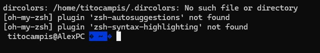
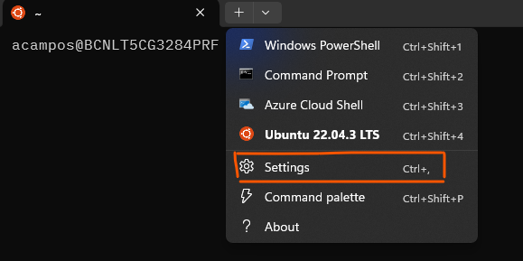
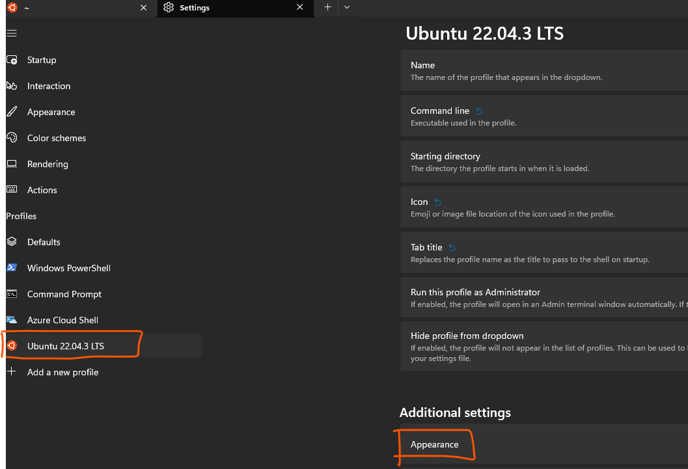
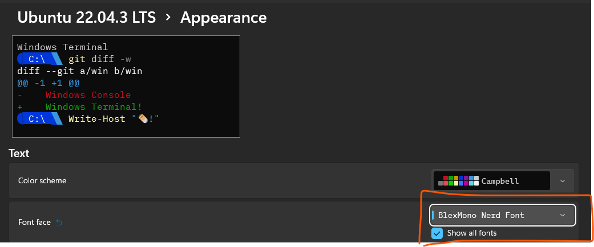

# Documentation of how to install and configure ohmyzsh in WSL (Ubuntu)

## Installation

The official documentation: [https://ohmyz.sh/](https://ohmyz.sh/)

One documentation very good explained: [https://blog.joaograssi.com/windows-subsystem-for-linux-with-oh-my-zsh-conemu/](https://blog.joaograssi.com/windows-subsystem-for-linux-with-oh-my-zsh-conemu/)

My ansible playbook: [roles/base/tasks/ohmyzsh.yml](roles/base/tasks/ohmyzsh.yml)

## Terminal Configuration

:one: Open the `~/.zshrc` file and include
```bash
# Set name of the theme to load --- if set to "random", it will
# load a random theme each time oh-my-zsh is loaded, in which case,
# to know which specific one was loaded, run: echo $RANDOM_THEME
# See https://github.com/ohmyzsh/ohmyzsh/wiki/Themes
ZSH_THEME="agnoster"

## set colors for LS_COLORS
eval `dircolors ~/.dircolors`

...

# Which plugins would you like to load?
# Standard plugins can be found in $ZSH/plugins/
# Custom plugins may be added to $ZSH_CUSTOM/plugins/
# Example format: plugins=(rails git textmate ruby lighthouse)
# Add wisely, as too many plugins slow down shell startup.
plugins=(
    git
    zsh-autosuggestions
    zsh-syntax-highlighting
    history
        sudo
        web-search
        copypath
        copyfile
)

source $ZSH/oh-my-zsh.sh
```

You will face the following error, don't panic



:two: Create the `.dircolors` file into your home directory
```bash
wget https://raw.githubusercontent.com/seebi/dircolors-solarized/master/dircolors.ansi-dark -O ~/.dircolors
```

:three: Clone the `zsh-autosuggestions` in the folder `~/.oh-my-zsh/custom/plugins/`
```bash
git clone https://github.com/zsh-users/zsh-autosuggestions ~/.oh-my-zsh/custom/plugins/zsh-autosuggestions
```

:four: :three: Clone the `zsh-zsh-syntax-highlighting` in the folder `~/.oh-my-zsh/custom/plugins/`
```bash
git clone https://github.com/zsh-users/zsh-syntax-highlighting.git ~/.oh-my-zsh/custom/plugins/zsh-syntax-highlighting
```

## Installing missing Powerline Fonts


:one: Clone the powerline repository in your wsl
```bash
git clone https://github.com/powerline/fonts.git
```

:two: Copy it into a windows directory

:three: With powershell, access to this directory and execute:

- To temporary allow run scripts in your current powershell session
```ps1
Set-ExecutionPolicy -ExecutionPolicy Bypass -Scope Process
```

- Install all the fonts on windows
```ps1
.\install.ps1
```

Also you can download the fonts directly from: [https://www.nerdfonts.com/font-downloads](https://www.nerdfonts.com/font-downloads)
And install them by just right click on them and install.

:four: Go to the terminal and:





Enable `Show All Fonts` and configure one with requirements for `ohmyzsh`:



Enjoy your `ohmyszh`!