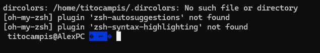
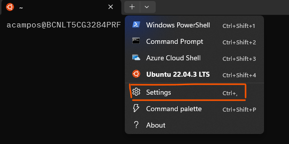
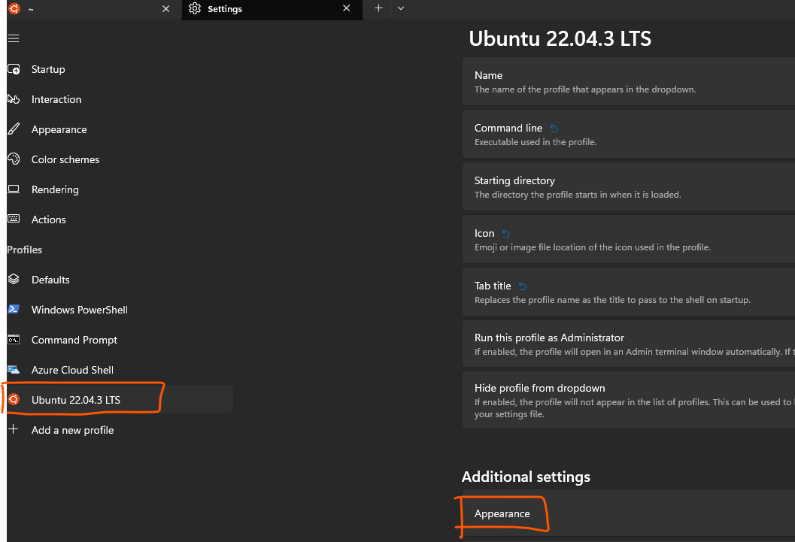
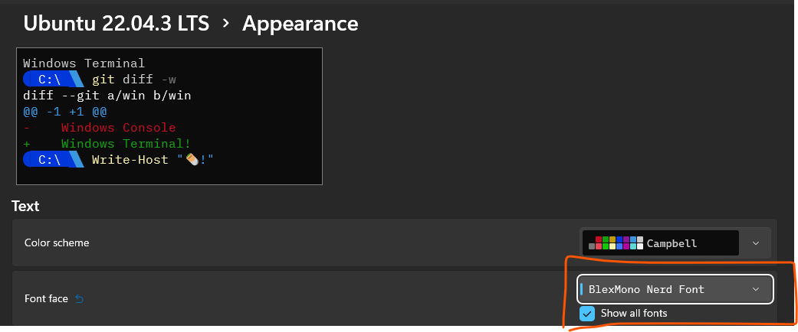

# README for WSL Configuration

Read this document carefully if you are configuring Ubuntu in your WSL.

## Index
- [README for WSL Configuration](#readme-for-wsl-configuration)
  - [Index](#index)
  - [Install and configure Ubuntu in WSL](#install-and-configure-ubuntu-in-wsl)
  - [Install and configure Ohmyzsh in WSL](#install-and-configure-ohmyzsh-in-wsl)
    - [Terminal Configuration](#terminal-configuration)
    - [Installing Nerd Fonts](#installing-nerd-fonts)

## Install and configure Ubuntu in WSL

One of the more spread workstations is WSL (Windows Subsystem for Linux) that's why how to install and make first configurations is explained:

:one: Go to windows Search and look for `Turn Windows features windows on or off`.

:two: Check that `Windows Subsystem for Linux` is enabled

:three: Open Powershell as administrator

:four: Execute the following command
```ps1
dism.exe /online /enable-feature /featurename:Microsoft-Windows-Subsystem-Linux /all /norestart
```

:five: Enable Virtual Machine feature
```ps1
dism.exe /online /enable-feature /featurename:VirtualMachinePlatform /all /norestart
```

:six: Download the Linux kernel update package
```ps1
wsl.exe --install
```

or

```ps1
wsl.exe --upgdate
```

:seven: Set WSL 2 as your default version
```ps1
wsl --set-default-version 2
```

:eight: Go to the microsoft store and download `Ubuntu`

:nine: Once it is downloaded, open it and enjoy!!!

## Install and configure Ohmyzsh in WSL

As installing `ohmyzsh` is an interactive work, I think that do it with ansible it is not worth at all. So here is how to do it manually, however you read the word `manually` do not suffer, it is very straight-forward.

The official documentation: [https://ohmyz.sh/](https://ohmyz.sh/)

One documentation very good explained: [https://blog.joaograssi.com/windows-subsystem-for-linux-with-oh-my-zsh-conemu/](https://blog.joaograssi.com/windows-subsystem-for-linux-with-oh-my-zsh-conemu/)

### Terminal Configuration
:one: Update and upgrade the system
```bash
sudo apt update && apt upgrade
```

:two: Install zsh
```bash
sudo apt install zsh
```

:three: Change default shell to zsh
```bash
chsh -s $(which zsh)
```

:four: Install `oh-my-zsh`
```bash
sh -c "$wget https://raw.github.com/ohmyzsh/ohmyzsh/master/tools/install.sh -O -)"
```

:five: Open the `~/.zshrc` file and include
```bash
# Set name of the theme to load --- if set to "random", it will
# load a random theme each time oh-my-zsh is loaded, in which case,
# to know which specific one was loaded, run: echo $RANDOM_THEME
# See https://github.com/ohmyzsh/ohmyzsh/wiki/Themes
ZSH_THEME="agnoster"

## set colors for LS_COLORS
eval `dircolors ~/.dircolors`

...

# Which plugins would you like to load?
# Standard plugins can be found in $ZSH/plugins/
# Custom plugins may be added to $ZSH_CUSTOM/plugins/
# Example format: plugins=(rails git textmate ruby lighthouse)
# Add wisely, as too many plugins slow down shell startup.
plugins=(
    git
    zsh-autosuggestions
    zsh-syntax-highlighting
    history
    sudo
    web-search
    copypath
    copyfile
)

```

> In WSL you will face the following error, don't panic
> 
>  
> 
> Create the `.dircolors` file into your home directory
> ```bash
> wget https://raw.githubusercontent.com/seebi/dircolors-solarized/master/dircolors.ansi-dark -O ~/.dircolors
> ```
> 

:six: Clone the `zsh-autosuggestions` in the folder `~/.oh-my-zsh/custom/plugins/`
```bash
git clone https://github.com/zsh-users/zsh-autosuggestions ~/.oh-my-zsh/custom/plugins/zsh-autosuggestions
```

:seven: Clone the `zsh-zsh-syntax-highlighting` in the folder `~/.oh-my-zsh/custom/plugins/`
```bash
git clone https://github.com/zsh-users/zsh-syntax-highlighting.git ~/.oh-my-zsh/custom/plugins/zsh-syntax-highlighting
``` 

### Installing Nerd Fonts
:one: Clone the powerline repository in your wsl
```bash
git clone https://github.com/powerline/fonts.git
```

:two: Copy it into a windows directory

:three: With powershell, access to this directory and execute:

- To temporary allow run scripts in your current powershell session
```ps1
Set-ExecutionPolicy -ExecutionPolicy Bypass -Scope Process
```

- Install all the fonts on windows
```ps1
.\install.ps1
```

Also you can download the fonts directly from: [https://www.nerdfonts.com/font-downloads](https://www.nerdfonts.com/font-downloads)
And install them by just right click on them and install.

:four: Go to the terminal and:





Enable `Show All Fonts` and configure one with requirements for `ohmyzsh`:



Enjoy your `ohmyszh`!
